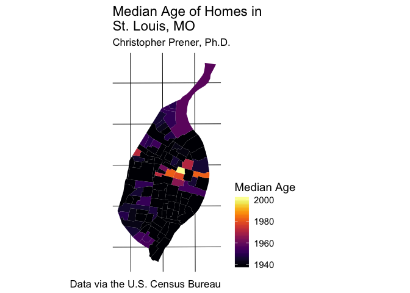

Lab 05 Replication Notebook
================
Christopher Prener, Ph.D.
(March 10, 2018)

Introduction
------------

This is the replication notebook for Lab-05 from the course SOC 4650/5650: Introduction to GISc.

Load Dependencies
-----------------

The following code loads the package dependencies for our analysis:

``` r
# tidyverse
library(ggplot2) # data plotting

# other packages
library(ggthemes) # map theme
library(here) # working directory tools
```

    ## here() starts at /Users/chris/Dropbox/Professional/Teaching/SOC 5650 - GIS/2018-Spring/Content/Lecture-06/Lab-05/lab-05-replication

``` r
library(sf) # spatial data tools
```

    ## Linking to GEOS 3.6.1, GDAL 2.1.3, proj.4 4.9.3

``` r
library(viridis) # color palettes
```

    ## Loading required package: viridisLite

Load Data
---------

The following code loads the data package and assigns our data to a data frame in our global environment:

``` r
housing <- st_read(here("data","STL_HOUSING_MedianAge", "Shapefile", "STL_HOUSING_MedianAge.shp"), 
                      stringsAsFactors = FALSE)
```

    ## Reading layer `STL_HOUSING_MedianAge' from data source `/Users/chris/Dropbox/Professional/Teaching/SOC 5650 - GIS/2018-Spring/Content/Lecture-06/Lab-05/lab-05-replication/data/STL_HOUSING_MedianAge/Shapefile/STL_HOUSING_MedianAge.shp' using driver `ESRI Shapefile'
    ## Simple feature collection with 106 features and 14 fields
    ## geometry type:  POLYGON
    ## dimension:      XY
    ## bbox:           xmin: 871505.9 ymin: 982585.2 xmax: 915266.8 ymax: 1070991
    ## epsg (SRID):    NA
    ## proj4string:    +proj=tmerc +lat_0=35.83333333333334 +lon_0=-90.5 +k=0.9999333333333333 +x_0=250000 +y_0=0 +datum=NAD83 +units=us-ft +no_defs

Create Median Home Age Map in `R`
---------------------------------

### Question 6

The code block below maps the data and adds a labeled legend, an appropriate theme, a title, and other map layout labels:

``` r
ggplot() +
  geom_sf(data = housing, mapping = aes(fill = ESTIMATE), color = NA) +
  scale_fill_viridis(name = "Median Age", option = "inferno") +
  theme_map(base_size = 14) +
  theme(legend.position = "right") +
  labs(
    title = "Median Age of Homes in \nSt. Louis, MO",    
    subtitle = "Christopher Prener, Ph.D.",
    caption = "Data via the U.S. Census Bureau"
  )
```



The map shows that the median age of homes in most neighborhoods is around 1940, with some post-war development in the southwest and far northern reaches of the city. The near north side and midtown area have far more recent residential development.

### Question 7

The following code exports our map to the `results/` folder:

``` r
ggsave(here("results", "medianAge.png"), dpi = 300)
```

    ## Saving 7 x 5 in image
